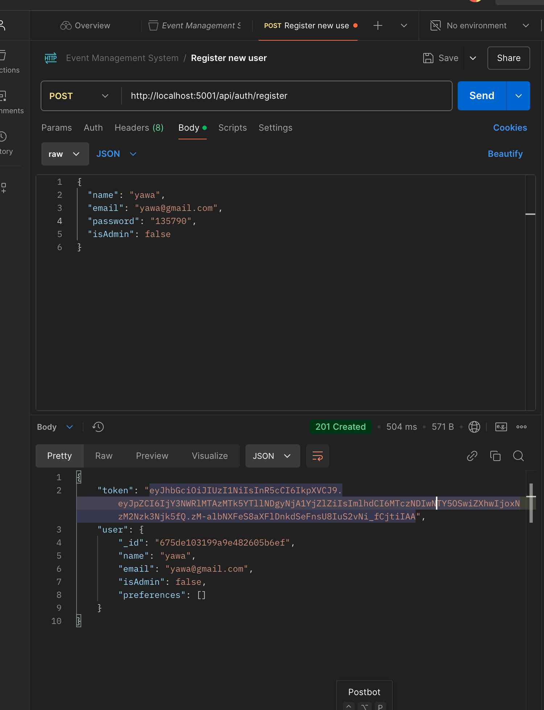
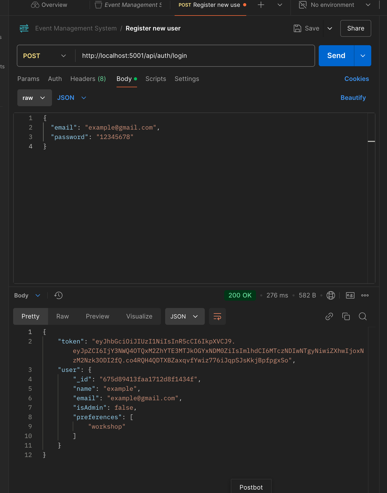

# Campus Event Management System

## Project Overview
The Campus Event Management System is a web application designed to help users discover, register, and manage campus events. The application allows users to view event details, register for events, and for admins to create and manage events.

## Deployment Link
You can access the deployed project at the following link: [Campus Event Management System](https://campusevents-d2mm3f65g-nhyiras-projects-799fa3d8.vercel.app/)

## Login Details
If the project includes authentication, you can use the following test login credentials:
- **Username:** testuser@example.com
- **Password:** password123

## Feature Checklist
- [x] User Registration
- [x] User Login
- [x] View Events
- [x] Event Details
- [x] Register for Events
- [x] Admin Dashboard
- [x] Create Events
- [x] Update Events
- [x] Delete Events
- [x] Check Registration Status

## Installation Instructions
To run the project locally, follow these steps:

1. **Clone the repository:**
   ```bash
   git clone https://github.com/yourusername/campus-event-management.git
   cd campus-event-management
   ```

2. **Navigate to the backend directory and install dependencies:**
   ```bash
   cd backend
   npm install
   ```

3. **Set up your environment variables:**
   Create a `.env` file in the backend directory and add your MongoDB connection string and JWT secret:
   ```plaintext
   PORT=5001
   MONGODB_URI=your_mongodb_connection_string
   JWT_SECRET=your_jwt_secret
   NODE_ENV=development
   ```

4. **Start the backend server:**
   ```bash
   npm run dev
   ```

5. **Navigate to the frontend directory and install dependencies:**
   ```bash
   cd ../frontend
   npm install
   ```

6. **Start the frontend application:**
   ```bash
   npm run dev
   ```

## API Documentation
Below are screenshots of Postman API tests on the endpoints used in the project. Please upload the screenshots to the `src/public` directory in the frontend and update the paths accordingly.


- **Register for Event Endpoint:**
  

- ** Login Endpoint:**
  


